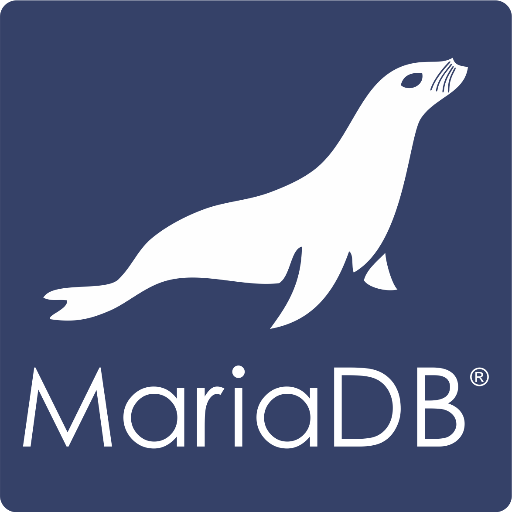

 <h1 align="center">Miguel Ángel Olmo Peña </h1>

    <picture></picture><b> Sobre mi: </b>
    

      

Aquí están algunos puntos clave sobre mí:
- **Aprendizaje continuo**: Me encanta aprender nuevas tecnologías y mejorar mis habilidades.
- **Trabajo en equipo**: Colaborar con otros profesionales me permite crecer y aportar mis conocimientos.
- **Objetivos claros**: Siempre enfocado en cumplir y superar las metas propuestas.

Si deseas saber más sobre mí, no dudes en contactarme por correo ( <a href="mailto:m.olmopena@gmail.com" style="text-decoration: none; color: black;"><b>m.olmopena@gmail.com</b></a> ) o visitar mi perfil de <a href="https://www.linkedin.com/in/miguelangelolmopena"><b>LinkedIn</b></a>.
    

    <picture></picture><b> Skills:</b>

- **Lenguajes**:   
       
    

- **Frameworks and Libraries**: 
        
 

- **Cloud Hosting**:    
    
        
 

- **Softwares and Tools**: 
    
    
       

 

    

        <h2 style="display: inline-block">Contáctame🤝</h2>  
    

    

    

        <a href="mailto:m.olmopena@gmail.com" ><b>m.olmopena@gmail.com</b></a>
    

       

      
      
      
   
  
